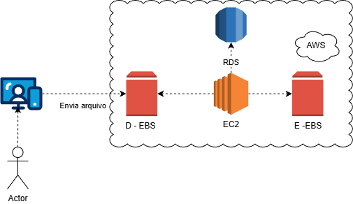

# Laboratorio: Gerenciamiento de Instancias EC2 en AWS

Este repositorio contiene la documentación y evidencia técnica del laboratorio de gestión de instancias Amazon EC2, almacenamiento EBS y conectividad con bases de datos RDS.

## 📊 Arquitectura del Proyecto
El siguiente diagrama (exportado de Draw.io) representa la infraestructura desplegada, donde un "Actor" envía archivos a una instancia EC2 que gestiona múltiples volúmenes de datos y se conecta a un motor de base de datos.

 
*(Nota: Asegúrate de exportar tu archivo .drawio como imagen PNG/JPG en la carpeta images)*

---

## 🛠️ Procesos Documentados

### 1. Transferencia de Archivos y Conectividad (SCP/SSH)
Se validó la capacidad de enviar datos desde un host local hacia la nube utilizando el protocolo **SCP** (Secure Copy).
* **Evidencia:** [Ver captura de envío de archivos](images/fileSend)
* **Comando utilizado:** `scp -i "DesafioTest.pem" tomatoestest.txt ec2-user@IP-PUBLICA:/home/ec2-user/`

### 2. Configuración de Almacenamiento Adicional (EBS)
Se añadió un segundo volumen EBS de 1GB para persistencia de datos. 
* **Insight Técnico:** Al utilizar una instancia basada en arquitectura Nitro (Amazon Linux 2023), el disco se identificó como `/dev/nvme1n1`.
* **Proceso:** Se formateó con el sistema de archivos **XFS** y se montó satisfactoriamente.
* **Evidencia:** [Ver captura de montaje de disco](images/Seconddisk)

### 3. Conexión a Base de Datos (RDS)
Se probó la comunicación entre la instancia EC2 y el servicio gestionado RDS utilizando el cliente de MariaDB.
* **Resultado:** Conexión exitosa al endpoint de la base de datos, validando que los *Security Groups* permiten el tráfico en el puerto 3306.
* **Evidencia:** [Ver captura de conexión RDS](images/rds)

---

## 💡 Conclusiones y Aprendizajes

1.  **Nomenclatura NVMe:** Es fundamental utilizar el comando `lsblk` para identificar dispositivos, ya que los nombres asignados en la consola de AWS pueden diferir de los reconocidos por el Kernel de Linux.
2.  **Seguridad en Capas:** La comunicación entre la EC2 y la RDS es segura gracias a las reglas de entrada que restringen el acceso solo a miembros del mismo grupo de seguridad.
3.  **Gestión de Archivos:** El uso de llaves `.pem` y comandos como `chmod 400` (en entornos Unix) o gestión de permisos en Windows es crítico para la seguridad del acceso.

---
**Entregable realizado por:** Sebastian Lopez 
**Repositorio para:** Desafío de Laboratorio Basico AWS GFT Technologies
 